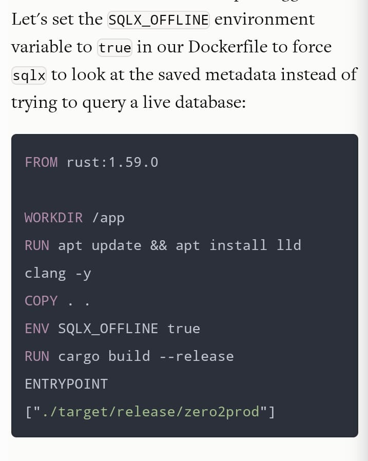

# PetClinicRUST
API em rust para consultório veterinário

## Features:
- Agendamento de consultas veterinárias
- Histórico de vacinas e tratamento para os pets
- Pesquisa de satisfação e contatos através de SMS e Whatsapp

## Stack:
- Actix Web
- Sqlx
- Postgres

## Steps to run the project:
- Run the sql artifact at /database/create_postgres.sql
- Cargo run

## Incompatibilidade encontrada entre o Docker e o SQLX
- o sqlx tenta expandir as macros quando o docker compose executa o build dos containers, isso
provoca a falha no build do container
- rodando com uma instancia do POSTGRES na máquina de desenvolvimento e com o o banco já criado
é possivel fazer a compilação normalmente e rodar o projeto
- UPDATE: acrescentar ao Dockerfile a variável de ambiente SQLX_OFFLINE e usar o SQLX CLI para preparar os metadados https://www.lpalmieri.com/posts/2020-11-01-zero-to-production-5-how-to-deploy-a-rust-application/#3-3-sqlx-offline-mode

